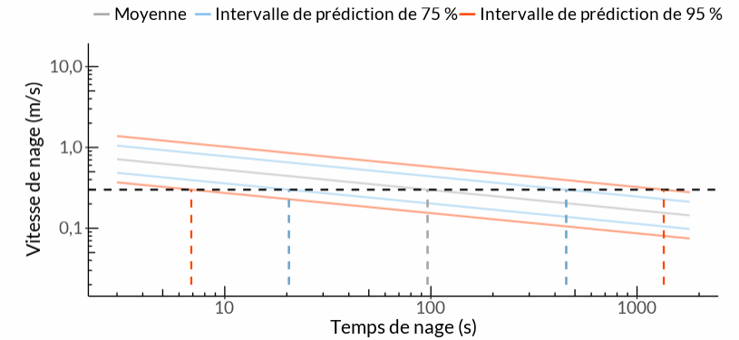

<!-- Google Analytics Script -->

# Outils de performance natatoire en ligne

Les OPNL sont une collection d’outils servant à estimer la performance natatoire des poissons. Les estimations présentées par ces outils peuvent s’avérer utiles pour élaborer et concevoir des systèmes de passage, d’exclusion et d’orientation du poisson. Ces outils interactifs en ligne effectuent des calculs complexes de façon fiable et automatique. Pour obtenir plus de renseignements sur ces outils et les calculs qu’ils effectuent, consultez le [Guide de l’utilisateur](https://fishprotectiontools.ca/fr/utilisateur.html). Un aperçu de chaque outil est présenté ci-dessous.

### Outil de vitesse et de temps de nage

L’[outil de vitesse et de temps de nage](https://fishprotectiontools.ca/fr/vitessetemps.html) génère un tracé qui indique la vitesse de nage par rapport au temps de nage et permet d’estimer un de ces éléments en fonction de l’autre (voir la figure 1). Cet outil nécessite l’espèce ou le groupe de poissons ainsi que la longueur des poissons pour effectuer les calculs. Cet outil peut servir à répondre à des questions comme :

* Pendant combien de temps un meunier noir de 100 mm peut-il garder une vitesse de nage de 0,5 m/s?
* À quelle vitesse une truite arc-en-ciel de 200 mm peut-elle nager pendant 5 minutes?

Pour obtenir de plus amples renseignements sur cet outil et un échantillon de problème, consultez le [Manuel sur l’outil de vitesse et de temps de nage](https://fishprotectiontools.ca/fr/utilisateur.html#exemple_de_vitesse_par_rapport_au_temps).

<figure>
  
  <figcaption>Figure 1. Exemple de tracé généré par l’outil de vitesse et de temps de nage.</figcaption>
</figure>

 

### Outil de distance de nage et de vitesse de l’eau

L’[outil de distance de nage et de vitesse de l’eau](https://fishprotectiontools.ca/fr/distancevitesse.html) ressemble beaucoup à l’outil de vitesse et de temps de nage, mais il trace la distance de nage par rapport à la vitesse de l’eau. Cet outil peut servir à répondre à des questions comme :

* Quelle est la vitesse maximale qu’un esturgeon jaune de 1 000 mm peut surmonter quand il nage sur une distance de 60 m?
* À quelle distance une truite mouchetée de 150 mm peut-elle nager dans un courant de 0,5 m/s?
* Pour obtenir de plus amples renseignements sur cet outil et un échantillon de problème, consultez le [Manuel sur l’outil de distance de nage et de vitesse de l’eau](https://fishprotectiontools.ca/fr/utilisateur.html#exemple_de_distance_par_rapport_%C3%A0_la_vitesse).

### Outil de longueur à maturité

L’[outil de longueur à maturité](https://fishprotectiontools.ca/fr/longueurmaturite.html) peut servir à consulter les données sur la maturité d’une espèce. L’outil présente un tableau de références dans lequel sont indiquées les longueurs minimales et moyennes à maturité. Dans les cas où le poisson mature doit franchir un obstacle pour compléter son cycle vital, la longueur à maturité peut s’avérer utile pour estimer la performance natatoire au moyen d’un autre outil du présent site Web. Par exemple, si le saumon de l’Atlantique en migration doit franchir un ponceau de 30 mètres pour atteindre un habitat de frai, quelle longueur de poisson conviendrait-il d’utiliser dans l’outil de distance de nage et de vitesse de l’eau?

### Outil de dimension du grillage à l’entrée d’une prise d’eau

L’[outil de dimension du grillage à l’entrée d’une prise d’eau](https://fishprotectiontools.ca/fr/prisedeau.html) calcule la superficie de grillage nécessaire au niveau de la prise d’eau pour éviter l’impaction de 97,5 % des poissons selon l’espèce, la longueur et la durée nécessaire pour qu’un poisson s’éloigne de la face du grillage. Des renseignements supplémentaires et un échantillon de problème se trouvent dans le [Manuel sur l’outil de dimension du grillage à l’entrée d’une prise d’eau](https://fishprotectiontools.ca/fr/manuel-prisedeau.html).

`r paste("Date modifiée", Sys.Date())`

