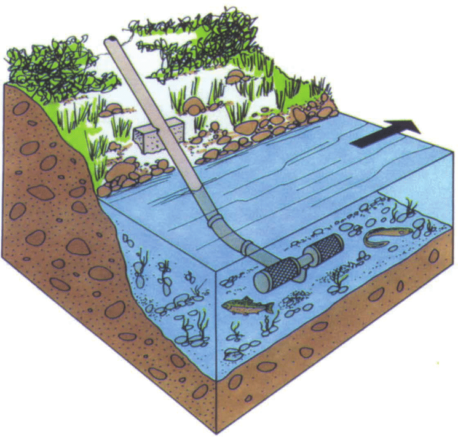
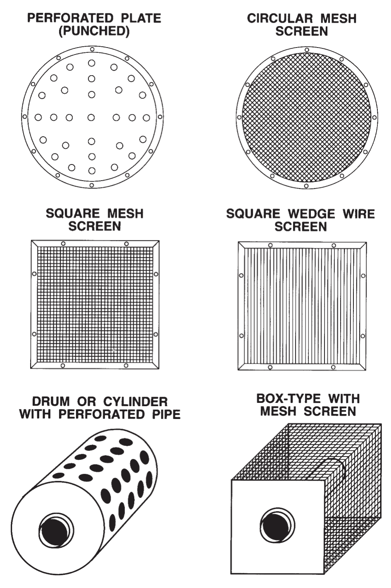
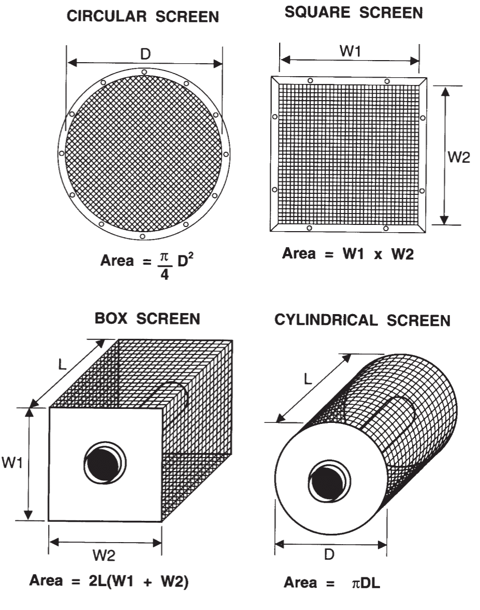

<!-- Google Analytics Script  -->
<script>
  (function(i,s,o,g,r,a,m){i['GoogleAnalyticsObject']=r;i[r]=i[r]||function(){
  (i[r].q=i[r].q||[]).push(arguments)},i[r].l=1*new Date();a=s.createElement(o),
  m=s.getElementsByTagName(o)[0];a.async=1;a.src=g;m.parentNode.insertBefore(a,m)
  })(window,document,'script','https://www.google-analytics.com/analytics.js','ga');

  ga('create', 'UA-88888600-1', 'auto');
  ga('send', 'pageview');

</script>


```{r setup, include=FALSE}
knitr::opts_chunk$set(echo = TRUE)
```

<!-- This script corrects the footnote links --> 
<script>
  var shiftWindow = function() { scrollBy(0, -100) };
  if (location.hash) shiftWindow();
  window.addEventListener("hashchange", shiftWindow);
</script>

# Introduction

Improperly designed or installed fish screens can result in the death of fish through entrainment^[When a fish is drawn into a water intake and cannot escape] or impingement^[When an entrapped fish is held in contact with the intake screen and is unable to free itself]. The severity of the impact on the fisheries resource and habitat depends on the water velocity, flow, depth, and intake design, as well as the abundance, distribution, size, swimming ability, and behaviour of the organisms in the vicinity of the intake.

Causing the death of fish that are part of or support a commercial, recreational, or Aboriginal fishery is prohibited in Canada under Section 35(1) of the Fisheries Act [@FisheriesAct]. Fisheries and Oceans Canada (DFO) has prepared the Freshwater Intake End-of-Pipe Fish Screen Guideline to assist proponents in the design and installation of fish screens to reduce or eliminate death of fish associated with freshwater intake pipes.

This document is an update to the 1995 guideline of the same name [@EndOfPipe]. The main purpose of this updated version is to incorporate a better understanding of fish swimming performance and increase the maximum amount of water extraction from 120 L/s to 1000 L/s.

<center>
<div style="width:400px; height=200px">

</div>
</center>

#Guideline Objectives

The objective of this guideline is to provide a national standard-of-practice and guidance for end-of-pipe fish screens at freshwater intakes to prevent potential losses of fish due to entrainment or impingement. The Freshwater Intake End-of-Pipe Fish Screen Guideline deals exclusively with the sizing and design of fixed screens that are often placed at the end of a pipe used to extract water up to 1 m<sup>3</sup>/s (1000 L/s). The guideline is intended for use in addressing fish screens for small permanent and temporary withdrawals for irrigation, construction, small municipal and private water supplies, etc. It is not intended for application to hydroelectric or canal screen designs; however, such proposals can be considered by regulatory agencies on a site-specific basis. The guideline focuses on the technical aspects of intake screens and the protection of fish rather than on policy, legislation, or environmental assessment processes and their application. 

This guideline has been developed to provide protection of freshwater fish with a minimum fork length of 25 mm. Plankton^[Plankton are free floating or drifting organisms] are highly susceptible to entrainment since they are unable to swim against intake-current and are likely to fit through the openings on an intake screen. Plankton are an important food source for freshwater fishes in Canada and although relatively few ichthyoplankton^[the eggs and larvae of fish] naturally survive to adulthood, additional deaths caused by water intakes could reduce recruitment^[Fish surviving to enter the fishery or maturity]. 
Protection of plankton is not one of the objective of this document but proponents should be aware of this potential effect of water withdrawal on the fishery. 


#Guidelines

The appropriate design of a fish screen is largely dependent upon the species and the size of fish requiring protection. Appropriate installation and maintenance/cleaning of the screen are also important in keeping approach velocities low and ensuring satisfactory operation of the screen. For the purposes of this guideline, emphasis is placed on the protection of freshwater fish with a minimum fork length^[The straight line distance measured from the tip of the nose to the fork of the tail] of 25 mm from entrainment and impingement due to water extraction activities. Depending upon site-specific circumstances, a case may be made whereby the minimum fork length size of fish to be protected is greater than 25 mm. In this instance, the fish screen criteria for open screen area^[The area of all open spaces on the screen available for the free flow of water] presented in Table 1 and screen mesh size (2.54 mm) do not apply. For fish larger than 25 mm, the swim speed must be estimated using the Screen Size Calculator application or refer to @katopodis2016fish. The estimated swim speed over a 10 minute period will determine the design approach velocity.

The following sections address the appropriate design of fixed freshwater intake end-of-pipe fish screens for the protection of fish with a minimum fork length of 25 mm. Guidance on installation, cleaning, and maintenance is provided. Common types of intake screens and associated intakes are also presented in Figure 2.

##Fish Screen Criteria

To protect fish from impingement or entrainment, the approach velocity (i.e., the water velocity into, or perpendicular to, the face of an intake screen) should not exceed certain values based on the swimming performance group of the species present in the watercourse.  Species groups with similar swimming performance are based on analysis of performance data and include the following: “Catfish & Sunfish Group”,"Eel Group”, "Herring Group", "Pike Group”, "Salmon & Walleye Group”, and “Sturgeon Group” [@katopodis2016fish]. Table 3 lists the species in each of these fish swimming performance groups. Contact DFO or provincial fisheries agencies regarding fish species that are not included in Table 3.

Approach velocities for each swimming performance group correspond to speed estimates which fish have a 97.5% chance of exceeding. A fork length of 25 mm and an endurance time of 10 minutes (the time the fish is in front of the face of the screen before it can elude it) were used to estimate fish speeds. The required open screen areas (m<sup>2</sup>) for several flows or water extraction quantities (L/s) to meet these approach velocity criteria were calculated and are presented in Table 1 and the Screen Size Calculator application (Section 3.2).  Open screen area is defined as the total submerged screen area which includes the screen face material but excludes major structural members. Open screen area is calculated using the following equation:

$$\text{Open Screen Area (m$^2$)} = \frac{\text{Flow Rate (m$^3$)}}{\text{Velocity (m)}}$$

Table 1 presents the required open screen area for end-of-pipe intake screens with a capacity up to 1 m<sup>3</sup> (1000 L/s). The open screen area is the area of all open spaces on the screen available for the free flow of water. The open screen area can also be calculated using the Screen Size Calculator application (Section 3.2). The application will calculate the required open screen area based on user selected fish species, fish length and time.

|Species Group|Design approach velocity (m/s) | Screen area (m<sup>2</sup>) per 1000 L/s of water | Screen area (m<sup>2</sup>) per 100 L/s of water | Screen area (m<sup>2</sup>) per 10 L/s of water|
|:-----------|:----------:|:------------:|:-----------:|:-----------:|
|Catfish & Sunfish   |   0.106  | 9.4   | 0.94  | 0.094|
|Eel                 |   0.035  | 28.7	| 2.87  | 0.287|
|Herring             |   0.093  | 10.8  | 1.08  | 0.108|
|Pike                |   0.055  | 18.2  | 1.82  | 0.182|
|Salmon & Walleye    |   0.098  | 10.2  | 1.02  | 0.102|
|Sturgeon            |   0.082  | 12.2  | 1.22  | 0.122|
:Table 1. Open screen area required for end-of-pipe water intakes.

##Screen Size Calculator

The End-of-Pipe Fish Screen tool calculates the screen area required to prevent impingement of 97.5% of fish based on species, length and the amount of time required for a fish to escape the face of the screen.

<!-- <center> -->
<!-- <iframe src="http://fishprotectiontools.ca/endofpipeguide/" style="border: none; width: 500px; height: 1000px"></iframe> -->
<!-- </center> -->

<iframe id="nestedIFrame" src="http://www.fishprotectiontools.ca/endofpipe" width="100%" frameBorder="0" scrolling="no"></iframe>

<!-- Load JS to automatically resize iframe depending on height of shiny app  -->
<script src="http://ajax.googleapis.com/ajax/libs/jquery/1.11.0/jquery.min.js"></script>
<script type="text/javascript" src="./JS/ie8.polyfils.min.js"></script>
<script type="text/javascript" src="./JS/iframeResizer.min.js"></script>
<script type="text/javascript">
   iFrameResize({heightCalculationMethod: "lowestElement"});
</script>

##Design of Fixed End-of-Pipe Fish Screens

Keeping fish screens clean maintains their effectiveness for supplying water and protecting fish.  Active screens are those equipped with proven cleaning capability which keeps them free of any debris that will restrict flow area and increase approach velocities.  Passive screens are those without an automated cleaning system and require larger screen areas to cope with the higher risk of flow area restriction due to plugging.  It is important to calculate the available open screen area of clean screens and allow a factor of safety for screens that are not regularly cleaned. Open screen area is the area occupied by the open spaces available for the free flow of water and excludes the screen face material.  

Once the required open screen area has been found (Table 1 or Section 3.2), the total screen area^[The area occupied by the open spaces (i.e., open screen area) and screen material available for the free flow of water] can be calculated as follows:

$$\text{Total Screen Area} =
\text{Open Screen Area} \div \left(\frac{\text{% Open Area (Table 2)}}{100}\right)$$

It should be noted that if the percent (%) open screen area is maximized, then the total screen area required for a given flow is minimized. The narrowest dimension of any opening on the screen is referred to as the design opening, regardless of opening shape. The maximum design opening for a fish of 25 mm fork length is estimated at 2.54 mm. The screen openings may be round, square, rectangular, or any combination thereof, but should not have any protrusions that could injure fish.

Screen materials may include brass, bronze, aluminum, monel metal, galvanized or stainless steel, and plastics. The screen material should be resistant to corrosion and UV light. Welded wedge wire screens offer reduced debris clogging and increased open area and screen stiffness, in comparison to round wire mesh and punch plate. Table 2 presents several common types of screening material that meet the requirements of wire diameter, clear opening width and percent open area. 

The dimensions of the fish screen can be calculated after the correct shape, configuration, location, and method of installation have been determined. This will usually be determined after a site investigation and a review of these guidelines. Included in Figure 3 are common screen shapes and the associated dimensions and area formulae. These are just examples of the many shapes and sizes in which fish screens can be fabricated. Screens are instream structures and, as such, should have sufficient strength and durability, and be capable of withstanding any potential large forces and impacts. Figure 1 illustrates an example configuration of an end-of-pipe fish screen. Figure 2 illustrates some examples of end-of-pipe screen designs.


|   Material | Wire Thickness (mm)  | Opening Width (mm)  | % Open Area |
|:-----------|:----------:          |:------------:       |:-----------:|
|8 $\times$ 8 Stainless Steel Alloy Mesh | 0.711   |  2.44  | 60|
|#7 Mesh Wire Cloth   | 1.025 | 2.54  | 51|
|#8 Mesh Wire Cloth   | 0.875 | 2.25  | 52|
|#8 Mesh Wire Cloth   | 0.700 | 2.54  | 62|
|#60 Wedge Wire Screen| 1.500 | 2.54  | 63|
|#45 Wedge Wire Screen| 1.100 | 2.54  | 69|
:Table 2. Examples of screen material.

<center><div style="width:400px; height=200px">

</div></center>

##Installation

Screens should be located in areas and depths of water with low concentrations of fish throughout the year. This includes areas with natural or man-made structures that attract fish during migration, spawning, or rearing. Screens should be installed at least 300 mm above the bed of the waterbody to reduce entrainment of sediment and benthos^[Organisms that occupy the bottom of bodies of water]. All openings for guides and seals should be smaller than the opening width of the screen material (usually 2.54 mm) so fish cannot pass through. Cylindrical and box-type screens should have a manifold installed to ensure the water velocity is evenly distributed across the screen surface. 

<center><div style="width:400px; height=200px">

</div></center>

Depending on the size of the screen and the flow at the installation location, structural support may be needed to prevent sagging or collapse of the screen panels. When designing a screen, account for the area blocked by supports while meeting the total screen area recommended in this guide. Heavier cages or trash racks can be fabricated out of bar (150 mm spacing is typical) or grating to protect the finer fish screen, especially where there is debris loading from woody material, leaves, or algae mats.

##Cleaning & Maintenance

Debris or damage to screens can cause uneven intake flow across the screen surface. Uneven flow may result in higher intake velocities on some sections of the screen, increasing the occurrences of impinged fish. Provision should be made for the inspection and cleaning of screens. Cleaning apparatuses, seals, and screens should be properly maintained. To facilitate intake screen cleaning and maintenance, design and installation features such as orientation of the screen (e.g., in a cove) or variation in mesh shape (i.e., square wire/bars versus round wire/bars), etc. may be considered for regularly cleaned screens. Flexible suction pipe may be used instead of solid, fixed piping for ease of screen removal and cleaning. If the screen must be removed for cleaning or maintenance, the intake pump should be turned off.  Pump suction pressure can be measured to assess the need for screen cleaning. For screens that will not be cleaned regularly, provision of considerably more open screen area (e.g., four times more) than determined from Table 1 or the Screen Size Calculator application (Section 3.2) may be considered.

#Sample Calculation

A proponent wishes to withdraw water at a rate of 0.1 m<sup>3</sup>/s from a nearby pond. The pond supports populations of brown trout, brook trout, and American eel. The intake is proposed to be cylindrical with the ends solid and #60 wedge wire screen around the cylinder. What size must the intake screen be to satisfy the guideline requirements?

There are 4 steps to finding the answer


1. Determine the fish swimming group
2. Determine the open screen area
3. Determine the dimensions necessary to produce the total screen area
4. Determine the total screen area

##Solution

1. <b>Fish Swimming Group:</b> 
The fish swimming group can be determined by referencing Table 3 where the common and scientific names of species in each group are listed. Brown trout and brook trout are in the "Salmon & Walleye" group. American eel are in the "Eel" group.

2. <b>Open Screen Area:</b> 
Table 1 lists the required effective screen area for each fish swimming performance group for flows up to 1000 L/s. To use the table, if necessary, first convert the flow from cubic metres per second to litres per second.

    $$0.1 \text{ m}^3 / \text{s} \times 1000 \text{ L} / \text{m}^3 =100 \text{ L} / \text{s}$$
    For a flow of 100 L/s, Table 1 indicates that the open screen area must be:
    + 1.02 m<sup>2</sup> for the “Salmon & Walleye" group
    + 2.87 m<sup>2</sup> for the “Eel" group
    
    The higher number (2.87 m<sup>2</sup>) is the more stringent requirement and therefore it is used in the calculation of effective screen area. Alternatively, you could use the Screen Size Calculator application to determine the open screen area. 
    <br>
    
3. <b>Total Screen Area:</b>
The screen material in this case is # 60 Wedge Wire. A review of Table 2 indicates that the % Open Area for this material is 63%. With this value and the previously determined Open Screen Area from Step 2, the following formula is used to determine the Total Screen Area for an active screen (i.e. with self-cleaning mechanism).
    $$\begin{eqnarray} \text{Total Screen Area} &=& \text{Open Screen Area} \div \left(\frac{\text{% Open Area}}{100}\right) \\ &=& 2.87\text{ m}^2 \div \left(\frac{63}{100}\right)\\ &=& 4.56\text{ m}^2 \end{eqnarray}$$
For passive screens, without regular cleaning, the Open Screen Area must be multiplied by 4:
    $$\begin{eqnarray} &=& 4.56 \text{ m}^2 \times 4 \\ &=& 18.23 \text{ m}^2 \end{eqnarray}$$
4. <b>Dimension of Intake Screen:</b>
Figure 3 lists several common screen shapes and their respective area formulae. For a cylindrical screen where the ends are solid and screening is around the cylinder, the following formula applies:
    $$\begin{eqnarray} \text{Area} &=& \pi \text{DL} \end{eqnarray}$$
The unknown dimensions are diameter (D) and length (L). These dimensions are determined by choosing a value for one and solving the equation for the other. If the diameter is 0.60 m, then the length follows as:
    $$\begin{eqnarray} 4.56 \text{ m}^2 &=& \pi (0.60 \text{ m})\text{L}\\ 4.56 \text{ m}^2 &=& (1.885 \text{ m})\text{L}\\ \text{L} &=& 4.56 \text{ m}^2 \div 1.885 \text{ m}\\ \text{L} &=& 2.42 \text{ m} \end{eqnarray}$$
A regularly cleaned 0.60 m diameter, 2.42 m long cylindrical screen would meet the design requirements.  It should be noted that the dimensions given are representative of the screening area only; they do not include any screen that may be blocked by framing, etc. 
        
#Species Groups

The following table contains a list of fishes with swimming performance data available. This is not an exhaustive list of fishes in Canada. If a species is not listed in Table 3, contact DFO or use a closely related species to determine which group is the best fit for an unlisted species.

|Group                                    |Common Name                              |Scientific Name                          |
|:----------------------------------------|:----------------------------------------|:----------------------------------------|
|Catfish & Sunfish                        |Blue catfish                             |*Ictalurus furcatus*                     |
|Catfish & Sunfish                        |Bluegill                                 |*Lepomis macrochirus*                    |
|Catfish & Sunfish                        |Channel catfish                          |*Ictalurus punctatus*                    |
|Catfish & Sunfish                        |Channel $\times$ blue hybrid catfish     |*Ictalurus punctatus* $\times$ *furcatus*|
|Catfish & Sunfish                        |Largemouth bass                          |*Micropterus salmoides*                  |
|Catfish & Sunfish                        |Longear sunfish                          |*Lepomis megalotis*                      |
|Catfish & Sunfish                        |Redbreast sunfish                        |*Leomis auritus*                         |
|Catfish & Sunfish                        |Smallmouth bass                          |*Micropterus dolomieu*                   |
|Catfish & Sunfish                        |Sunfish                                  |*Lepomis incisor*                        |
|Catfish & Sunfish                        |White crappie                            |*Pomoxis annularis*                      |
|Eel                                      |Burbot	                                  |*Lota lota*                              |
|Eel                                      |European eel	                            |*Anguilla anguilla*                      |
|Eel                                      |Pacific lamprey                          |*Lampetra tridentata*                    |
|Eel                                      |Sea lamprey                              |*Petromyzon marinus*                     |
|Herring                                  |Alewife                                  |*Alosa pseudoharengus*                   |
|Herring                                  |American shad                            |*Alosa sapidissima*                      |
|Herring                                  |Blueback herring                         |*Alosa aestivalis*                       |
|Herring                                  |Twaite shad                              |*Alosa fallax*                           |
|Pike                                     |Northern pike                            |*Esox lucius*                            |
|Pike                                     |Tiger muskellunge                        |*Esox sp.*                               |  
|Salmon & Walleye                         |Arctic char                        	    |*Salvelinus alpinus*                     |
|Salmon & Walleye                         |Arctic cisco                           	|*Coregonus autumnalis*                   |
|Salmon & Walleye                         |Arctic grayling                        	|*Thymallus arcticus*                     |
|Salmon & Walleye                         |Atlantic salmon                        	|*Salmo salar*                            |
|Salmon & Walleye                         |Barbel                                   |*Barbus barbus*                          |
|Salmon & Walleye                         |Blacknose dace	                          |*Rhinichthys atratulus*                  |
|Salmon & Walleye                         |Blackspot shiner                         |*Notropis atrocaudalis*                  |
|Salmon & Walleye                         |Blacktail shiner                         |*Cyprinella venusta*                     |
|Salmon & Walleye                         |Bonytail chub	                          |*Gila elegans*                           |
|Salmon & Walleye                         |Bream	                                  |*Abramis brama*                          |
|Salmon & Walleye                         |Broad whitefish	                        |*Coregonus nasus*                        |
|Salmon & Walleye                         |Brook trout	                            |*Salvelinus fontinalis*                  |
|Salmon & Walleye                         |Brown trout	                            |*Salmo trutta*                           |
|Salmon & Walleye                         |Bull trout	                              |*Salvelinus confluentus*                 |
|Salmon & Walleye                         |Bullhead minnow	                        |*Pimephales vigilax*                     |
|Salmon & Walleye                         |Carp	                                    |*Cyprinus carpio*                        |
|Salmon & Walleye                         |Central stoneroller	                    |*Campostoma anomalum*                    |
|Salmon & Walleye                         |Chinook salmon	                          |*Oncorhynchus tshawytscha*               |
|Salmon & Walleye                         |Chum salmon                              |*Oncorhynchus keta*                      |
|Salmon & Walleye                         |Cisco	                                  |*Coregonus artedii*                      |
|Salmon & Walleye                         |Coho salmon	                            |*Oncorhynchus kisutch*                   |
|Salmon & Walleye                         |Colorado squawfish                       |*Ptychocheilus lucius*                   |
|Salmon & Walleye                         |Creek chub	                              |*Semotilus atromaculatus*                |
|Salmon & Walleye                         |Crucian carp	                            |*Carassius carassius*                    |
|Salmon & Walleye                         |Cutthroat trout	                        |*Oncorhynchus clarki*                    |
|Salmon & Walleye                         |Dace	                                    |*Leuciscus leuciscus*                    |
|Salmon & Walleye                         |Emerald shiner	                          |*Notropis atherinoides*                  |
|Salmon & Walleye                         |European chub	                          |*Leuciscus cephalus*                     |
|Salmon & Walleye                         |European grayling                        |*Thymallus thymallus*                    |
|Salmon & Walleye                         |European perch	                          |*Perca fluviatilis*                      |
|Salmon & Walleye                         |Fathead minnow	                          |*Pimephales promelas*                    |
|Salmon & Walleye                         |Flannelmouth sucker	                    |*Catostomus laipinnis*                   |
|Salmon & Walleye                         |Flathead chub	                          |*Platygobio gracilus*                    |
|Salmon & Walleye                         |Ghost shiner	                            |*Notropis buchanani*                     |
|Salmon & Walleye                         |Gudgeon	                                |*Gobio gobio*                            |
|Salmon & Walleye                         |Humpback chub	                          |*Gila cypha*                             |
|Salmon & Walleye                         |Inconnu	                                |*Stenodus leucichthys*                   |
|Salmon & Walleye                         |June sucker                        	    |*Chasmistes liorus*                      |
|Salmon & Walleye                         |Lake trout                               |*Salvelinus namaycush*                   |
|Salmon & Walleye                         |Lake whitefish                         	|*Coregonus clupeaformis*                 |
|Salmon & Walleye                         |Largescale sucker                        |*Catostomus macrocheilus*                |
|Salmon & Walleye                         |Least chub                               |*Iotichthys phlegethontis*               |
|Salmon & Walleye                         |Least cisco                        	    |*Coregonus sardinella*                   |
|Salmon & Walleye                         |Longnose dace                          	|*Rhinichthys cataractae*                 |
|Salmon & Walleye                         |Longnose sucker                        	|*Catostomus catostomus*                  |
|Salmon & Walleye                         |Mimic shiner                           	|*Notropis volucellus*                    |
|Salmon & Walleye                         |Mountain sucker                          |*Catostomus platyrhynchus*               |
|Salmon & Walleye                         |Mountain whitefish                       |*Prosopium williamsoni*                  |
|Salmon & Walleye                         |Northern squawfish                       |*Ptychocheilus oregonensis*              |
|Salmon & Walleye                         |Pink salmon	                            |*Oncorhynchus gorbuscha*                 |
|Salmon & Walleye                         |Plains minnow	                          |*Hybognathus placitus*                   |
|Salmon & Walleye                         |Proserpine shiner                        |*Cyprinella proserpina*                  |
|Salmon & Walleye                         |Rainbow/Steelhead trout                  |*Oncorhynchus mykiss*                    |
|Salmon & Walleye                         |Red River shiner                         |*Notropis bairdi*                        |
|Salmon & Walleye                         |Red shiner	                              |*Cyprinella lutrensis*                   |
|Salmon & Walleye                         |Redfin shiner	                          |*Lythrurus umbratilis*                   |
|Salmon & Walleye                         |Redside shiner	                          |*Richardsonius balteatus*                |
|Salmon & Walleye                         |Ribbon shiner	                          |*Lythrurus fumeus*                       |
|Salmon & Walleye                         |Rio Grande darter                        |*Etheostoma grahami*                     |
|Salmon & Walleye                         |Roach	                                  |*Rutilus rutilus*                        |
|Salmon & Walleye                         |Sabine shiner	                          |*Notropis sabinae*                       |
|Salmon & Walleye                         |Sacramento splittail                     |*Pogonichthys macrolepidotus*            |
|Salmon & Walleye                         |Sand shiner	                            |*Notropis stramineus*                    |
|Salmon & Walleye                         |Sharpnose shiner                         |*Notropis oxyrhynchus*                   |
|Salmon & Walleye                         |Silverband shiner                        |*Notropis shumardi*                      |
|Salmon & Walleye                         |Silvery minnow	                          |*Hybognathus amarus*                     |
|Salmon & Walleye                         |Smalleye shiner	                        |*Notropis buccula*                       |
|Salmon & Walleye                         |Sockeye salmon	                          |*Oncorhynchus nerka*                     |
|Salmon & Walleye                         |Southern leatherside chub                |*Lepidomeda aliciae*                     |
|Salmon & Walleye                         |Speckled chub	                          |*Macrhybopsis aestivalis*                |
|Salmon & Walleye                         |Speckled dace	                          |*Rhinichthys osculus*                    |
|Salmon & Walleye                         |Spottail shiner	                        |*Notropis hudsonius*                     |
|Salmon & Walleye                         |Steelhead trout	                        |*Oncorhynchus mykiss*                    |
|Salmon & Walleye                         |Striped bass	                            |*Morone saxatilis*                       |
|Salmon & Walleye                         |Striped shiner	                          |*Luxilus chrysocephalus*                 |
|Salmon & Walleye                         |Texas shiner	                            |*Notropis amabilis*                      |
|Salmon & Walleye                         |Topeka shiner	                          |*Notropis topeka*                        |
|Salmon & Walleye                         |Walleye	                                |*Sander vitreus*                         |
|Salmon & Walleye                         |Weed shiner	                            |*Notropis texanus*                       |
|Salmon & Walleye                         |White perch	                            |*Morone americana*                       |
|Salmon & Walleye                         |White sucker	                            |*Catostomus commersoni*                  |
|Salmon & Walleye                         |Yellow perch	                            |*Perca flavescens*                       |
|Sturgeon                                 |Lake sturgeon                          	|*Acipenser fulvescens*                   |
|Sturgeon                                 |Pallid sturgeon                        	|*Scaphirhynchus albus*                   |
|Sturgeon                                 |Shortnose sturgeon                     	|*Acipenser brevirostrum*                 |
|Sturgeon                                 |Shovelnose sturgeon                    	|*Scaphirhynchus platorynchus*            |
|Sturgeon                                 |White sturgeon	                          |*Acipenser transmontanus*                |
:Table 3. Summary of fish species in each fish swimming performance groups.    


# References