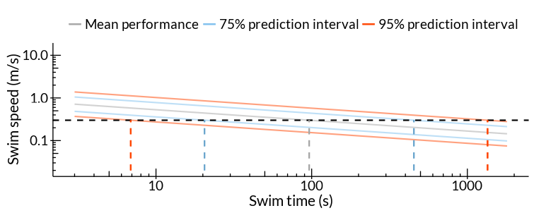

<!-- Google Analytics Script -->

The ability to predict fish swim speed and stamina is helpful in the development and design of fish passage, exclusion, and guidance systems. This website predicts fish swim performance using a model built on 27,030 individual fish found in 132 data sources. For details on the model, dataset and how these calculations are performed, see [Katopodis &amp; Gervais (2016)](http://www.dfo-mpo.gc.ca/csas-sccs/Publications/ResDocs-DocRech/2016/2016_002-eng.pdf). The model calculates the mean swimming performance surrounded by 75% and 95% prediction intervals. These intervals show the expected range of swim performance values. For example, 95% of unsampled fish should fall within the bounds of the 95% prediction interval.

Three tools have been built using the modeled data:

* Swim Speed & Swim Time
* Swim Distance & Water Velocity
* End-of-Pipe Screen Size

The <b>Swim Speed & Swim Time tool</b> and the <b>Swim Distance & Water Velocity tool</b> dynamically draw plots based on fish species and length selected by the user. Using the "calculate" button within either tool draws a black dotted line on the plot. At the locations where the black line intersects the prediction intervals, additional coloured lines are drawn on the plot (see Figure 1). The values corresponding to these locations are printed in the "Estimates" section below the plot area.

<figure>
  
  <figcaption>Figure 1. Sample plot from the Swim Speed & Swim Time tool</figcaption>
</figure>

 

The <b>End-of-Pipe Fish Screen tool</b> calculates the screen area required to prevent impingement of 97.5% of fish based on species, length and the amount of time required for a fish to escape the face of the screen. The tool specifically estimates the required Open Screen Area which is simply the area of all open spaces on the screen available for the free flow of water.
